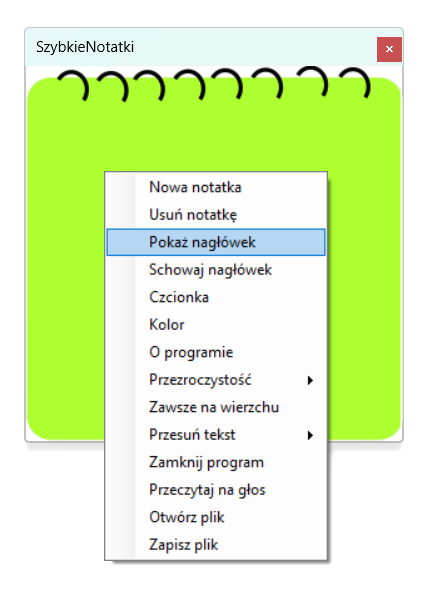
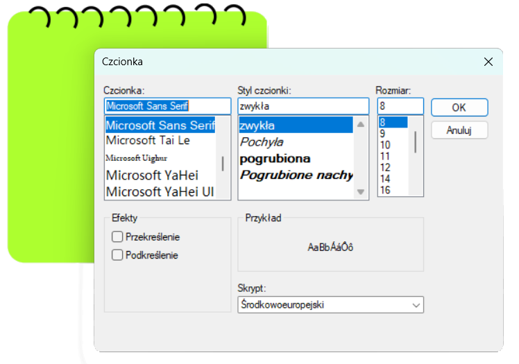
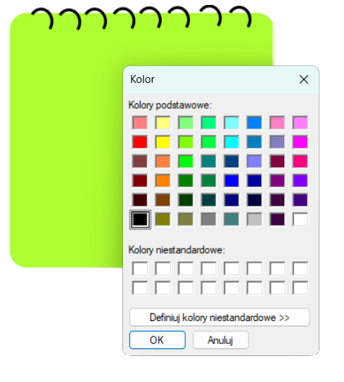

#  SzybkieNotatki

#### :green_circle: O aplikacji
#### Jest to aplikacja desktopowa stworzona w języku C# przy użyciu Windows Forms, umożliwiająca szybkie tworzenie i zarządzanie notatkami. Aplikacja jest prosta w użyciu i pozwala użytkownikom na efektywne organizowanie swoich notatek.

#### :green_circle:Wymagania systemowe

| System operacyjny Windows 7 lub nowszy |
| ------ |
| .NET Framework 4.7.2 lub nowszy|

#### :green_circle: Instrukcja 
- Uruchom aplikację, klikając F5 w Visual Studio lub uruchamiając skompilowany plik SzybkieNotatki.exe w katalogu bin/Debug.
#### :green_circle: Interfejs 
 

- aplikacja umożliwia tworzenie wielu notatek, a także ich zapisywanie
- daje możliwość odczytywania zapisanego tekstu, dzięki funkcji "Przeczytaj na głos"
- ponadto wbudowany edytor tekstu, a także możliwość regulacji przeźroczystości notatek
- dzięki opcji "zawsze na wierzchu" pomimo otwratych wielu okien, SzybkaNotatka zawsze będzię widoczna 

 
